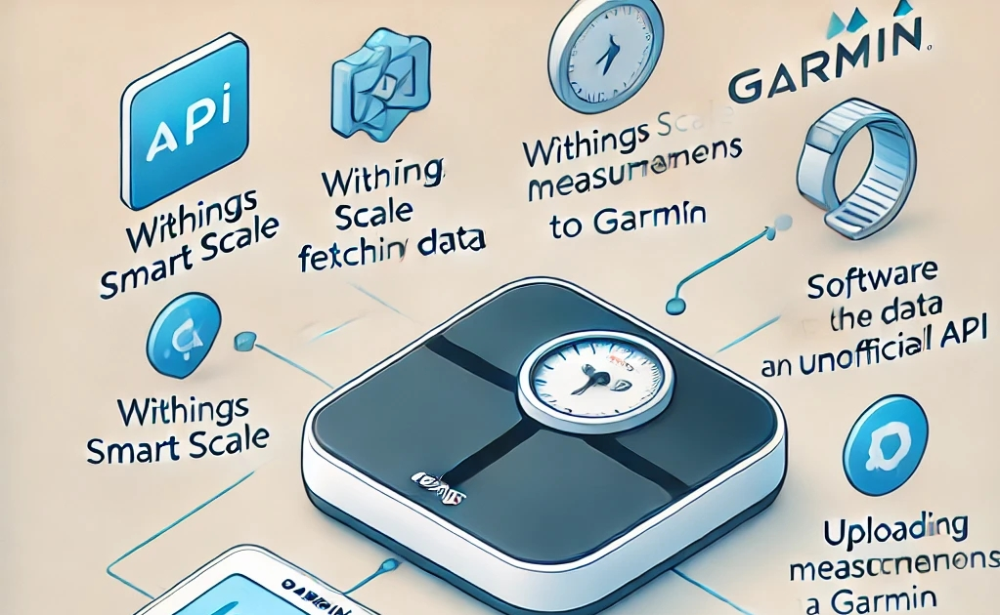

# Withings to Garmin Sync



The purpose of this project is to sync measurement results from a Withings scale to Garmin. Withings data is fetched using an application registration (official API).

Garmin data upload uses an unofficial API project: https://github.com/sealbro/dotnet.garmin.connect

## Functionality

The program retrieves the user's most recent weight from Withings. If the weight has not yet been uploaded to Garmin using this application, it will be saved (eg. first run). The timestamp of the entry will be the time of the execution, not the actual measurement date.

If the program is run again, no data will be sent to Garmin unless a new measurement has been recorded in Withings.

The program only syncs weight measurements, excluding other metrics such as body fat percentage.

## Registering a Withings Application

To fetch data from Withings, you need to register an application in the Withings Developer Portal.
Visit the [Withings Developer Portal](https://developer.withings.com/) and log in with your Withings account. 
- Go to the **"Overview"** section and click **"Create an application"**.
- Fill in the required fields:
    - **Services**:
	- [x] Public API integration					 
    - **Name**: Choose a name for your application (e.g., `WithingsToGarminSync`).
	- **Description**: Write a short description of what the application does.
	- **Registered URLs**: Enter "https://localhost". This URL must match what you configure in your application.
- Copy and save your `Client ID` and `Client Secret`. These will be needed to configure the application.

After completing these steps, your Withings application is ready, and you can use it to fetch weight data with this software.

## Docker

Create ``docker-compose.yml``:

```yml
version: "3.8"

services:
  withings-to-garmin:
    image: artop/withings-to-garmin
    container_name: withings-to-garmin
    restart: unless-stopped
    volumes:
      - ./appsettings.json:/app/appsettings.json # required, see the stub file
      - ./data.json:/app/data.json # required, will hold the Withings access token
      - ./withings.json:/app/withings.json # optional, contains parsed data from the Withings API
      - ./logs:/app/logs # optional, for serilog files
    environment:
      - CRON_SCHEDULE=0 6-10 * * *  # Run everyday hourly from 6 to 10 am
```

Create new files. Remember to edit the appsettings.json 

```bash
touch appsettings.json
touch data.json
touch withings.json # optional
mkdir logs # optional
```

Run the container and setup Withings token

```bash
docker compose up -d

# run once to setup the Withings token
# this command can also be for manual sync
docker compose exec withings-to-garmin /app/WithingsToGarminSync
```

All done, enjoy!

## Building From the Source

[.NET 8 SDK](https://dotnet.microsoft.com/download/dotnet/8.0) is required to build the project. 

```bash
git clone https://github.com/artop123/withings-to-garmin-sync.git
cd withings-to-garmin-sync
cp WithingsToGarminSync/appsettings.stub.json WithingsToGarminSync/appsettings.json
dotnet restore
dotnet build
dotnet test
```

Publish the application (linux example):

```bash
dotnet publish \
    -c Release \
    -r linux-x64 \
    --self-contained true \
    /p:PublishSingleFile=true \
    /p:EnableCompressionInSingleFile=true \
    -o /path/to/publish
```

Edit the appsettings

```bash
cd /path/to/publish
pico appsettings.json
```

Run the application

```bash
./WithingsToGarminSync
```

## Running the Software (Windows)

1. You need to have the [.NET 8 runtime](https://dotnet.microsoft.com/download/dotnet/8.0) installed
2. [Download the latest release](https://github.com/artop123/withings-to-garmin-sync/releases/latest)
3. Edit the appsettings.json
4. Run the application

## Scheduling the Software

You can schedule the program using crontab. For example, to run the program hourly between 6:00 AM and 10:00 AM every day:

1. Open `crontab` for editing:

```bash
crontab -e
```

2. Add the following line:
```bash
0 6-10 * * * cd /path/to/publish && ./WithingsToGarminSync
```

Save and exit the editor.
